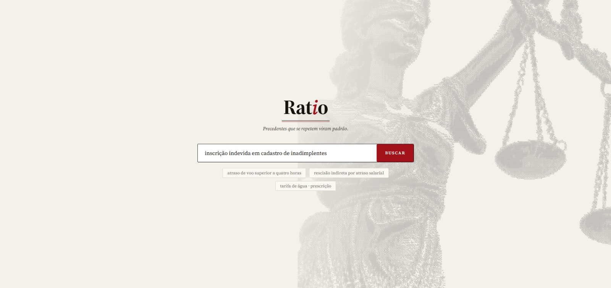

# Ratio 
> (latim: razão, fundamento). De ratio decidendi — o fundamento determinante de
> uma decisão judicial, aquilo que de fato se repete e vira padrão.

## Índice
- [Introdução](#introdução)
- [Principais Funcionalidades](#principais-funcionalidades)
- [Equipe](#equipe)
- [Como contribuir?](#como-contribuir)
  - [Branches](#branches)
  - [Commits](#commits)

## Introdução
O Ratio tem como objetivo eliminar o trabalho manual e fragmentado da análise jurisprudencial que impede advogados e magistrados de identificar com segurança o posicionamento dos tribunais sobre uma determinada tese, permitindo avaliar rapidamente sua aceitação, recorrência e grau de consolidação para embasar decisões e estratégias jurídicas, por meio da centralização e análise de jurisprudências, precedentes e doutrinas do TJSP, TJRJ e TJMG em um Data Warehouse jurídico, com busca semântica por tema e geração de indicadores e padrões de decisão rastreáveis às fontes originais.

## Principais Funcionalidades
- Busca por tema, em linguagem natural — o usuário descreve o caso com suas próprias palavras e recebe o tema jurídico já identificado, sem precisar montar sintaxe de busca ou saber o nome técnico da tese.
- Padrão de decisão consolidado — percentual de acolhimento, volume de processos e tribunais envolvidos, calculados automaticamente. Elimina a tabulação manual de decisões em planilha.
- Nota de força do entendimento — indica o quão consolidado (ou instável) é aquele padrão, considerando concordância entre decisões, volume, cobertura e recência.
- Rastreabilidade — cada número exibido leva de volta à sua fonte e à data de extração; nenhuma métrica é inventada ou calculada "no escuro".
- Cobertura multi-tribunal — dados centralizados de TJSP, TJRJ e TJMG, os três tribunais com maior volume processual do país.
- Acesso a precedentes e doutrina relacionados — afim de manter a rastreabilidade, é possível acessar a todos os precedentes e doutrinas relacionados que foram utilizados para sumarizar o tema.

# Prodcut Backlog  
| ID | Prioridade | Descrição | Estimativa | Sprint |
| --- | --- | --- | --- | --- |
| **US-01** | Must | Como **advogado**, quero digitar o tema do meu caso em linguagem natural e receber temas jurídicos apurados — não uma lista de processos — para descobrir como aquilo vem sendo decidido sem garimpar acórdão por acórdão | 8 | Sprint 1 |
| **US-02** | Must | Como **advogado**, quero que os resultados venham ordenados pela firmeza do entendimento, e não por relevância textual, para encontrar primeiro o que me serve para sustentar a tese | 2 | Sprint 1 |
| **US-04** | Must | Como **advogado**, quero filtrar os resultados por tribunal, período, grau e força mínima, vendo quantos processos cada tribunal tem, para reduzir a lista ao recorte do meu caso | 5 | Sprint 1 |
| **US-05** | Should | Como **advogado**, quero que a busca separe teses distintas que hoje caem no mesmo assunto do CNJ, para encontrar a tese do meu caso e não a categoria dela | 13 | Sprint 1 |
| **US-09** | Must | Como **juiz**, quero ler o entendimento do tema em prosa, abrindo com o número que responde à pergunta e com o processo apurado junto de todo percentual, para entender o padrão sem abrir tabela | 8 | Sprint 1 |
| **US-10** | Must | Como **advogado**, quero ver a distribuição dos desfechos do tema em uma figura com a fonte declarada, para enxergar de uma vez quanto é procedente, parcialmente procedente e improcedente | 5 | Sprint 1 |
| **US-13** | Should | Como **advogado**, quero que a aba que estou vendo fique na URL, para mandar a um colega o link exato da parte que quero mostrar | 2 | Sprint 1 |
| **US-18** | Could | Como **juiz**, quero ver os precedentes qualificados ligados ao tema — súmula, tema repetitivo, IRDR — distinguindo o que vincula de direito do que apenas persuade, para saber o que me obriga | 8 | Sprint 1 |
| **US-21** | Could | Como **advogado**, quero ver a doutrina invocada com autor, obra e a posição dela no debate, com link para o artigo quando houver, para saber o que citar além de jurisprudência | 8 | Sprint 1 |
| **US-23** | Could | Como **advogado**, quero ler o inteiro teor da decisão citada, para conferir o contexto antes de usá-la | 5 | Sprint 1 |
| **US-24** | Must | Como **advogado**, quero que toda tela deixe claro que os dados cobrem TJSP, TJRJ e TJMG, para não tirar conclusão nacional de um percentual que reflete três estados | 2 | Sprint 1 |
| **US-25** | Must | Como **juiz**, quero saber de que fonte e de que data de extração vem cada número que estou vendo, para saber exatamente o que estou citando | 3 | Sprint 1 |
| **US-26** | Must | Como **advogado**, quero que a tela me diga o que não existe e por quê, em vez de mostrar campo vazio ou valor plausível, para não construir uma peça sobre dado que não existe | 3 | Sprint 1 |
| **US-03** | Must | Como **advogado**, quero ver em cada resultado a nota, a matéria, o título da tese, um resumo curto, os tribunais, o volume, o período, a última decisão e o percentual favorável, para comparar teses antes de abrir qualquer uma | 8 | Sprint 2 |
| **US-38** | Could | Como **advogado**, quero sugestões de consultas frequentes na tela inicial, para entender o tipo de pergunta que a ferramenta responde antes de digitar a minha | 2 | Sprint 2 |
| **US-06** | Must | Como **advogado**, quero uma nota de 0 a 100 dizendo quão firme é o entendimento sobre o tema, para saber se vale sustentar a tese ou se ela é briga aberta | 8 | Sprint 2 |
| **US-07** | Must | Como **advogado**, quero que a nota venha com o grau em linguagem que já existe no meio jurídico — Consolidada, Dominante, Em formação, Divergente — para não precisar interpretar uma escala inventada | 2 | Sprint 2 |
| **US-08** | Must | Como **juiz**, quero abrir a composição da nota — os quatro componentes, seus pesos e a base de cálculo — para poder citar a estatística sabendo exatamente de onde ela vem | 3 | Sprint 2 |
| **US-11** | Must | Como **juiz**, quero ver como o alinhamento do tema evoluiu ano a ano, com a frase de tendência, para saber se o entendimento está se firmando ou virando | 5 | Sprint 2 |
| **US-12** | Must | Como **advogado**, quero ver o alinhamento do tema por tribunal, para saber se a tese pega igual em São Paulo, no Rio e em Minas | 3 | Sprint 2 |
| **US-14** | Must | Como **juiz**, quero uma tabela do comportamento de cada tribunal — decisões, alinhamento e data da última — para comparar o meu tribunal com os outros | 3 | Sprint 2 |
| **US-15** | Must | Como **advogado**, quero uma amostra auditável dos processos que sustentam o tema, com órgão julgador, data e desfecho, para conferir os casos antes de citá-los | 5 | Sprint 2 |
| **US-17** | Should | Como **juiz**, quero saber se as câmaras do meu tribunal estão decidindo igual entre si, para identificar divergência interna antes de decidir | 5 | Sprint 2 |
| **US-19** | Could | Como **advogado**, quero ver os fundamentos invocados nas decisões do tema, com a frequência e a taxa de acolhimento de cada um, para escolher o argumento que mais ganha e evitar o que perde sempre | 13 | Sprint 2 |
| **US-22** | Could | Como **advogado**, quero o nome do relator na amostra e na referência da citação, para montar a citação completa da petição | 5 | Sprint 2 |
| **US-37** | Could | Como **juiz**, quero ver no texto do entendimento o acórdão que sustenta cada afirmação, com a referência completa e a lista das decisões citadas ao pé, para citar a mesma decisão na minha | 8 | Sprint 2 |
| **US-27** | Should | Como **advogado**, quero exportar em CSV as decisões que sustentam o tema, para trabalhar os dados fora da ferramenta | 5 | Sprint 3 |
| **US-28** | Should | Como **advogado**, quero copiar a citação do tema já com a fonte, a data de extração, o escopo e o processo apurado, para colar na petição sem transcrever à mão | 3 | Sprint 3 |
| **US-29** | Should | Como **juiz**, quero saber quando o dado foi atualizado pela última vez, e ser avisado quando ele está velho, para não decidir sobre um retrato de meses atrás | 3 | Sprint 3 |
| **US-30** | Could | Como **advogado**, quero saber quanto tempo costuma levar do ajuizamento até a decisão nesse tema, para calibrar a expectativa do meu cliente | 8 | Sprint 3 |
| **US-34** | Should | Como **advogado**, quero perguntar em linguagem natural para um chatbot sobre um tema e receber a resposta em prosa com os números, para as perguntas que não cabem em nenhum filtro da tela | 13 | Sprint 3 |
| **US-35** | Should | Como **juiz**, quero que toda resposta do chatbot traga o processo apurado, a fonte, a data de extração, o escopo e o link para os processos, para poder conferir antes de usar | 5 | Sprint 3 |
| **US-36** | Should | Como **advogado**, quero que o chatbot diga não sei quando o dado não está na base, para não receber um número plausível e inventado | 3 | Sprint 3 |

##  Escala de Estimativa
| SP | Significado | Camadas | Incerteza |
| --- | --- | --- | --- |
| **1** | ajuste isolado: um texto, uma formatação | 1 | nenhuma |
| **2** | a última peça de algo que outra story já entregou | 1 | nenhuma |
| **3** | trabalho próprio em uma camada: um bloco, uma tabela, um componente | 1 | nenhuma |
| **5** | duas camadas, ou uma regra que alguém precisa definir | 2 | alguma |
| **8** | atravessa do banco à tela, ou o time nunca fez aquilo | 3+ | real |
| **13** | grande **e** incerta — teto da escala, candidata a quebra no refinamento | todas | alta |

## MoSCoW
| Prioridade | Significado |
| --- | --- |
| **Must** | Obrigatório para a entrega. Sem este item, o produto não cumpre seu objetivo principal, não atende ao requisito essencial ou não pode ser considerado funcional/avaliável. Deve ser priorizado antes de qualquer outro item. |
| **Should** | Importante para uma entrega completa. O produto ainda funciona sem este item, mas sua ausência gera uma perda relevante de qualidade, usabilidade ou cobertura do objetivo. Deve entrar se houver capacidade disponível após os Must. |
| **Could** | Melhoria desejável. Agrega valor ao produto, mas não compromete a entrega caso fique de fora. É o primeiro grupo a ser reduzido ou adiado quando houver restrição de prazo, equipe ou capacidade. |
| **Won't** | Fora da entrega atual. O item foi analisado e deliberadamente não será desenvolvido neste ciclo/projeto. Deve ser registrado no Fora do escopo para evitar que volte ao backlog como uma demanda inesperada. |

## Equipe

  <table>
    <thead>
      <tr>
        <th align="center">Integrante</th>
        <th align="center">Função</th>
        <th align="center">GitHub</th>
      </tr>
    </thead>
    <tbody>
          <tr>
        <td align="center">Vinicius de Pádua</td>
        <td align="center">Product Owner</td>
        <td align="center"></td>
      </tr>
      <tr>
        <td align="center">João Vitor Andrade</td>
        <td align="center">Scrum Master</td>
        <td align="center"></td>
      </tr>
      <tr>
        <td align="center">João Vitor Baranov</td>
        <td align="center">Developer</td>
        <td align="center"></td>
      </tr>
      <tr>
        <td align="center">Victor Nogueira</td>
        <td align="center">Developer</td>
        <td align="center"></td>
      </tr>
      <tr>
        <td align="center">Richard Cordeiro</td>
        <td align="center">Developer</td>
        <td align="center"></td>
      </tr>
      <tr>
        <td align="center">Isaac Oliveira</td>
        <td align="center">Developer</td>
        <td align="center"></td>
      </tr>
      <tr>
        <td align="center">Thiago Abreu</td>
        <td align="center">Developer</td>
        <td align="center"></td>
      </tr>
    </tbody>
  </table>

## Como contribuir?
### Branches
- **Feature Branching + branch por Sprint**
- **main:** Branch principal e estável do projeto. Recebe merges apenas ao final de cada sprint, após revisão e aprovação.
- **sprintX** (ex: sprint1, sprint2, sprint3): Cada sprint possui sua própria branch base, onde são integradas todas as funcionalidades desenvolvidas durante aquele ciclo.
- **taskpai-subtask-nome-da-task-com-traço-se-tiver-espaco:** Para cada nova funcionalidade ou correção, é criada uma branch específica a partir da branch da sprint em andamento. Essa Branch é criada com base na task do board. Exemplo: `RATIO-35-0.1-Implementar-documentação-API`
- **Repositório de documentação:** tendo em vista que as branches deste repositório não são ligadas a taks, devem seguir um padrão diferente. Deve apenas conter o nome da aplicação acompanhado da palavra “**DOCS**” e da descrição do que está sendo feito, por exemplo, `RATIO-DOCS-Definition-of-Done`, `RATIO-DOCS-Product-Backlog`
### Commits
**Todos os commits para qualquer repositório deste projeto devem ser feitos em inglês**  
Cada commit deve ser pequeno, descritivo e objetivo, seguindo o padrão de convenção semântica:

- `feat:` descrição da nova funcionalidade
- `fix:` correção de bug ou comportamento inesperador
- `factor:` melhoria de código sem alterar comportamento
- `docs:` atualização de documentação
- `chore:` tarefas de configuração, build ou manutenção

Exemplo: `feat: add semantic search by legal topic`

O número de commits é usado como indicador de contribuição individual e progresso da sprint, permitindo rastrear o fluxo de trabalho no repositório
